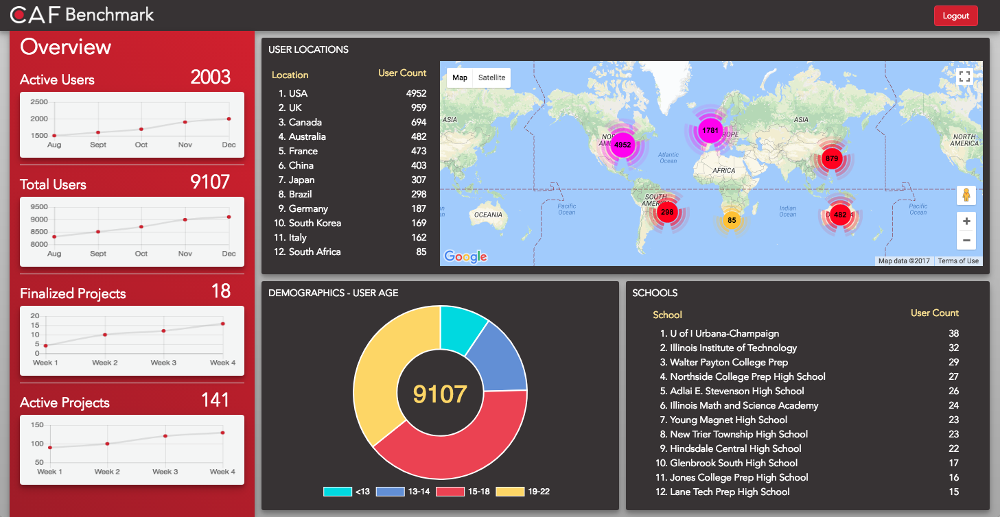

# Chicago Architecture Foundation (CAF) Learning Analytics Dashboard
A learning analytics dashboard collecting Chicago Architecture Foundation's key data points from various sources.

## Features
* CAF Dashboard reads user information from a MySQL database.
* Login authentication (Firebase).
* Dashboard users can view:
	* Overview: Current and past number of "Total Users", "Active Users", "Finalized Projects", and "Active Projects" with correlating timeline graph (Chart.js).
	* User Location: Number of users by country, featuring a user location cluster map (React-Google-Maps).
	* Demographics: User age featuring interactive donut chart (Chart.js).
	* Number of users by schools (National and Chicago).

## Team Members
* React Frontend - Casey Aitken
* Express Backend - Stephanie Stella
* Scrum Master/ DB Dude /Github Guardian - Edge Quintanilla

## Outline of Proposal
CAF has a robust set of data for its various education programs from online interactions on DiscoverDesign.org to in-person informal learning experiences. Currently data collected from these experiences exist in a multitude of dashboards and offline data sets. The CAF Learning Analytics Dashboard will provide CAF staff and stakeholders a unified view of all pertinent data sets for reporting and fundraising efforts. 

Key users will be able to save important data queries for continued use and increased value. This tool will make it easier for stakeholders to derive insights and make data-driven decisions for future education efforts to focus on. 

This is a real-world project with immediate implementation and use by CAF after the conclusion of this bootcamp. Last year CAF conducted a formal evaluation of its online data which will serve as the basis for this project. Key metrics have been identified for MVP:  

* Active Users 
* Location of Users
* Demographic Information
* User Schools (National and Chicago)